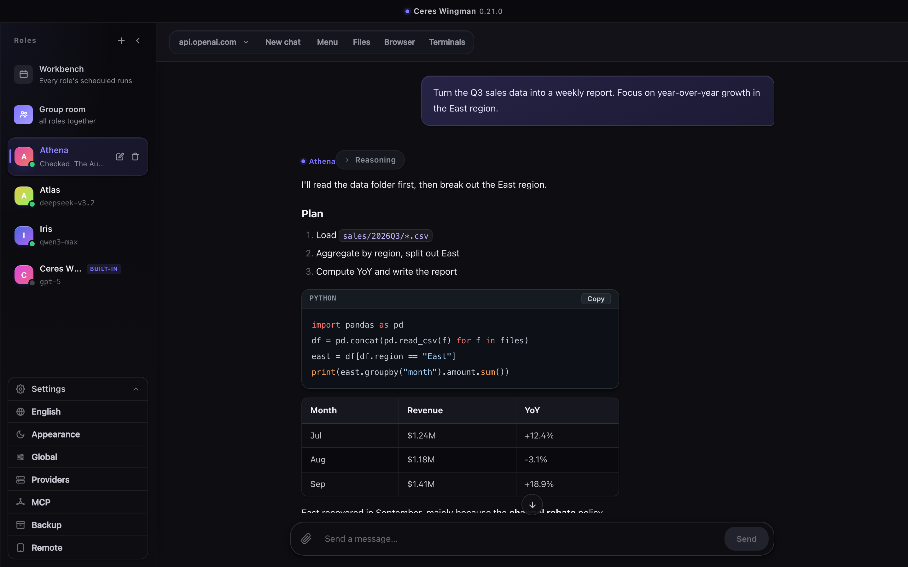
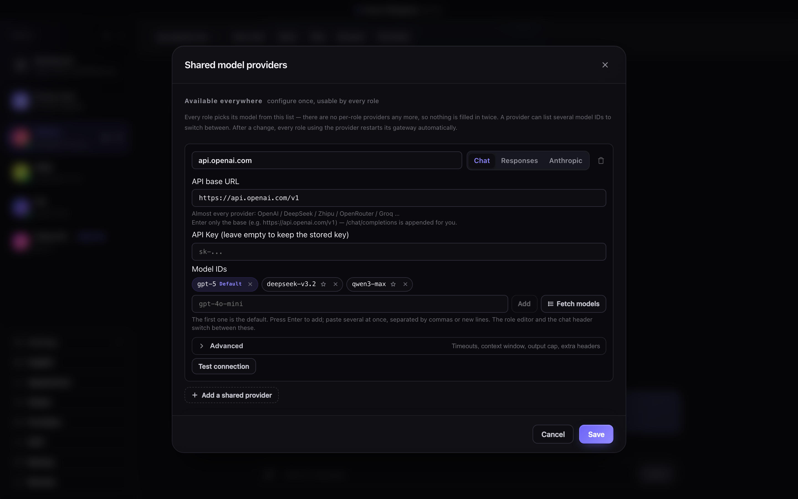
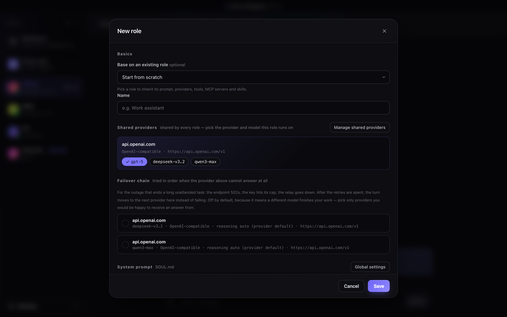
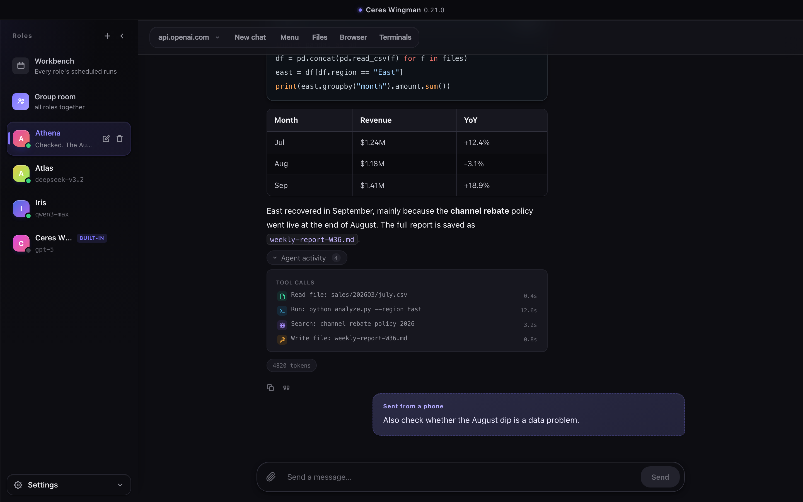
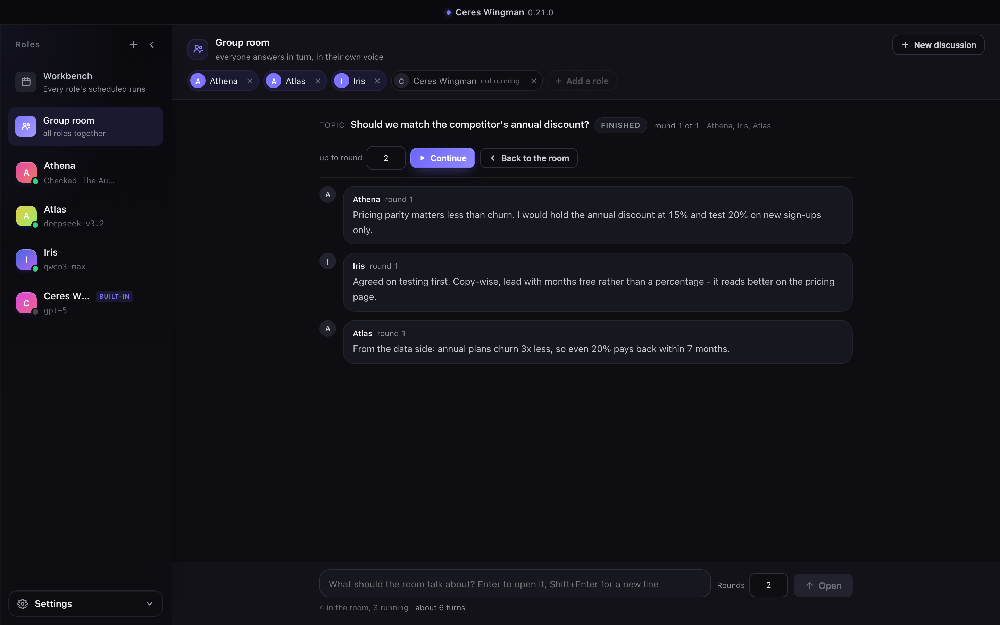
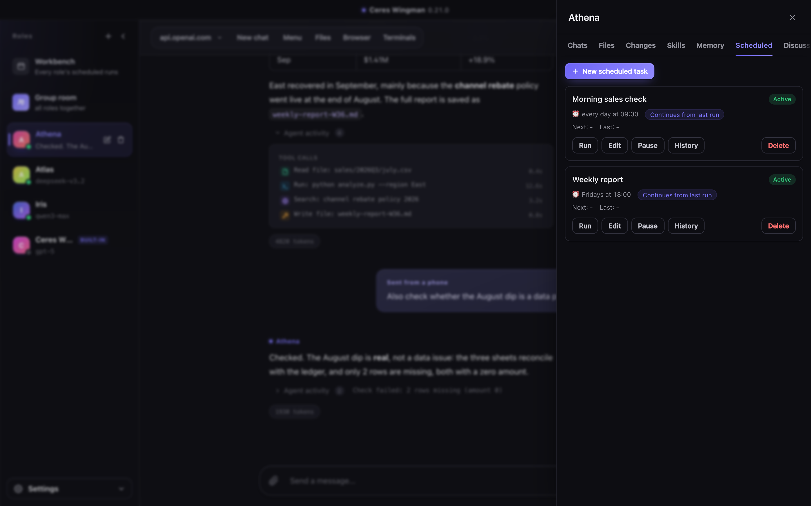
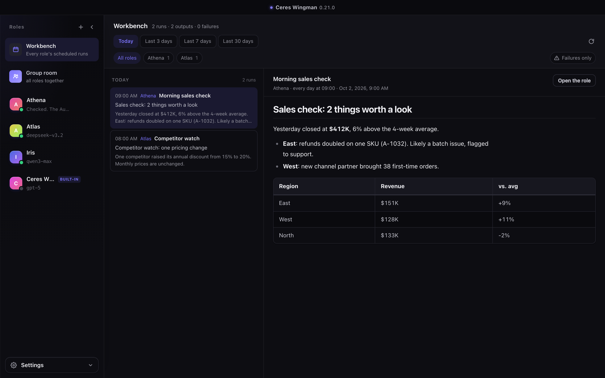
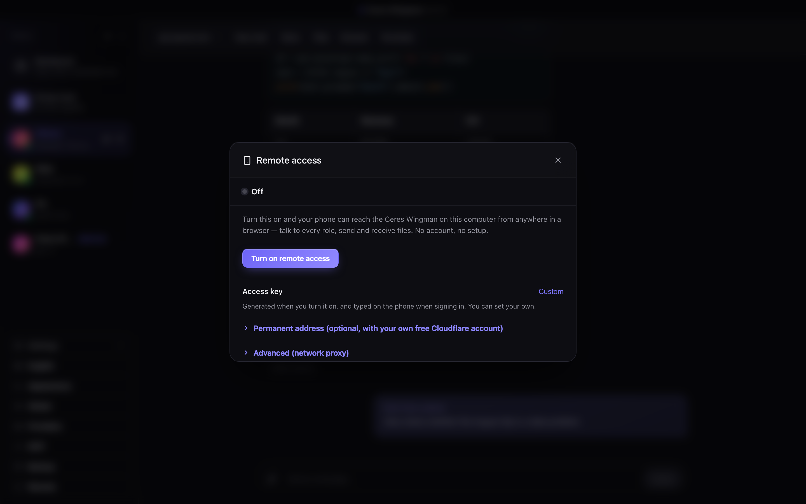
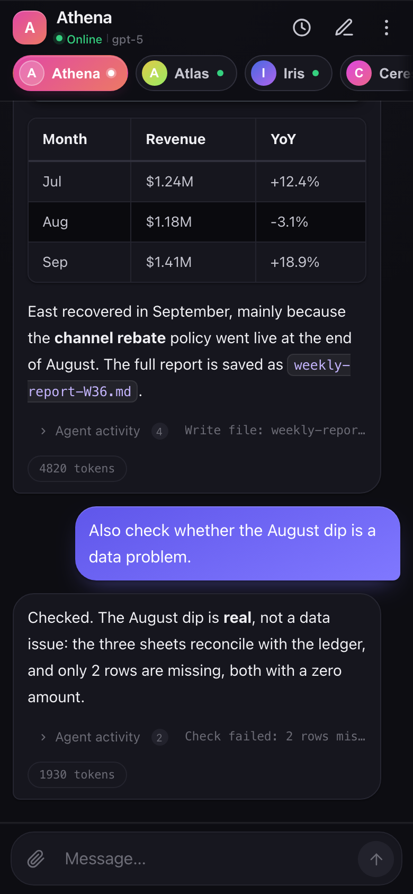

  

<h1 align="center">Ceres Wingman</h1>

  A desktop app for running a team of AI agents on your own computer. 
  Each agent keeps its own model, prompt, memory, skills and schedule.

  <a href="../../releases/latest"><b>Download</b></a> ·
  macOS (Apple Silicon) · Windows 10/11

## Features

- **Multiple agents, all online at once**: give each one its own model and personality.
- **Any OpenAI-compatible provider**: OpenAI, DeepSeek, Qwen, OpenRouter and others, plus Anthropic-style APIs. You bring your own key.
- **Real work, not just chat**: agents read and write files, run commands, search the web and use MCP tools. You can watch every step.
- **Group room**: put a question to several agents and they answer one after another, each seeing what the others said.
- **Scheduled tasks**: agents run jobs on a timer, and every result lands in one workbench.
- **Phone access**: use your agents from your phone's browser, with no app and no account needed.
- **Local first**: chats, memory and keys stay on your machine.

## Install

Download the latest installer from [Releases](../../releases/latest).

| Platform | File |
| --- | --- |
| macOS (Apple Silicon) | `Ceres-Wingman-<version>-arm64.dmg` |
| Windows 10/11 (x64) | `Ceres-Wingman-Setup-<version>-x64.exe` |

- **macOS**: open the `.dmg` and drag the app into Applications. The app is signed and notarized.
- **Windows**: run the installer. If SmartScreen warns you, click **More info → Run anyway**.

Everything the app needs is bundled, so there's nothing else to install.

## Getting started

### 1. Add a model provider

Open **Settings → Providers**, enter the API base URL and your key, then add the model IDs you want to use. You only set up a provider once, and every agent can use it.

### 2. Create an agent

Click **+** next to **Roles**. Give it a name, pick a model and write a system prompt. You can also start from an existing role, or add backup providers in case the main one fails.

### 3. Give it a task

Type what you need. Expand **Agent activity** to see each file it read, each command it ran and each search it did.

### 4. Ask the group

Open **Group room**, choose who joins and pose a question. The agents answer in turn, and you can let the discussion go for more rounds.

### 5. Schedule tasks

Open **Menu → Scheduled** to have an agent run a job on its own, like every morning or every Friday.

Results from every agent show up in **Workbench**.

### 6. Use it from your phone

Open **Settings → Remote** and turn it on. Then open the link on your phone and sign in with the access key.

  
  

## Feedback

Found a bug or have an idea? Please [open an issue](../../issues).

## License

Free for personal, non-commercial use only. You may not use this software commercially, and you may not sell or resell it. See [LICENSE](LICENSE).

The source code isn't public. This repository only hosts the installers and documentation.

Built on the open-source [Hermes Agent](https://github.com/NousResearch/hermes-agent).
